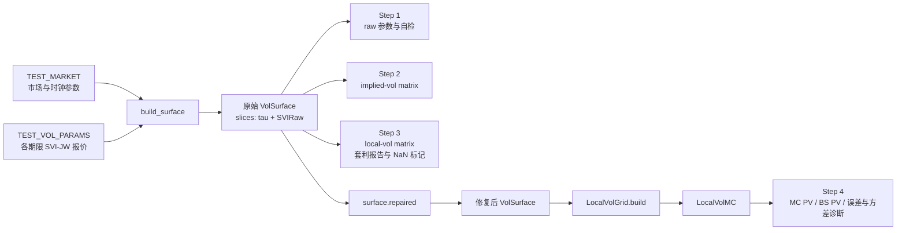

# SVI Local Volatility 项目：Step 1–4 完整函数调用链路

> **历史说明。** 本文是原 pricing task Step 1–4 的调用链快照，其中部分
> “当前状态”描述已被后续修复取代；它不定义动态 Alpha 研究的 Step 1。
> 新研究的有效边界、日期/期限轴和 `alpha=0/1/2` 约定见
> `DYNAMIC_ALPHA_READINESS.md`，可执行状态以测试与 `research.py` 预检为准。

本文按当前代码的真实执行顺序，解释项目如何从一组 SVI-JW 报价出发，依次得到：

1. 每个期限的 SVI-raw 参数；
2. 日期 × strike level 的 implied-volatility 矩阵；
3. 日期 × spot ratio 的 local-volatility 矩阵及套利标记；
4. 基于 local volatility 的 Monte Carlo 定价，并与 implied-volatility/Black-Scholes 定价比较。

本文只覆盖题目 Step 1–4。Step 5 的 delta 范围和 Step 6 的 backtest 属于扩展内容，不纳入主链路。

> **当前代码状态提示**
>
> - Step 3 使用原始、未修复曲面，用来识别和报告 calendar arbitrage。
> - Step 4 使用 `surface.repaired()` 生成的 calendar-repaired 曲面，以便建立可用于模拟的 local-vol 网格。
> - Step 4 当前输出的 bump delta 是“固定同一张 local-vol 网格”的 delta；它并不是 mentor 所说的 `s = 1` 曲面联动 delta。两者的函数调用链在本文最后单独区分。
> - `jw_to_raw()` 中当前实际执行的 `beta` 是文档版本的 `sqrt(omega * tau)`。但是它附近的旧 docstring、逆变换和部分测试尚未同步，因此 Step 1 的 skew round-trip self-check 可能失败。这个检查目前只打印警告，不会中断 Step 2–4。

---

## 1. 项目入口和总调用顺序

### 1.1 运行入口

在项目根目录运行：

```bash
cd /home/ran/Huatai_intern/SVI_volatility_surface
/home/ran/Huatai_intern/a50_cffex_latency_analysis/.venv/bin/python solution.py --no-backtest
```

其中：

- 根目录的 `solution.py` 是一个很薄的启动文件；
- 它从 `svi_localvol.solution` 导入公开函数；
- 作为脚本运行时调用 `svi_localvol.solution.cli()`；
- `--no-backtest` 只跳过扩展 Step 6，不影响 Step 1–4；
- 如果增加 `--fast`，Step 4 使用 20,000 条路径，否则使用 100,000 条路径。

真实入口链路如下：

```text
根目录 solution.py
└── svi_localvol.solution.cli()
    ├── 解析 --fast / --no-backtest
    └── main(n_paths, run_backtest)
        ├── build_surface(TEST_MARKET, TEST_VOL_PARAMS)
        ├── step1_parameters(surface)
        ├── step2_implied(surface, maturity, levels)
        ├── step3_localvol(surface, maturity, levels)
        ├── surface_mc = surface.repaired()
        └── step4_montecarlo(
                surface_mc,
                maturity,
                strike,
                n_paths,
                raw_surface=surface,
                comparison_levels=levels,
            )
```

### 1.2 数据在四步之间怎样传递



最重要的对象是 `VolSurface`。Step 1 并不是算完一张表再把表交给 Step 2；真正被后续步骤复用的是内存中的 `surface.slices`：

```text
VolSurface
├── market
│   ├── pricing_date
│   ├── spot
│   ├── rate
│   ├── dividend
│   └── repo
├── quotes
│   └── 每个 VolDate 的 SVI-JW 报价
└── slices
    ├── Slice(VolDate_1, tau_1, SVIRaw_1)
    ├── Slice(VolDate_2, tau_2, SVIRaw_2)
    └── ...
```

CSV 是运行结果和检查材料，不是下一步的输入。Step 2–4 不会重新读取 Step 1 输出的 CSV。

---

## 2. 四步共用的定义

### 2.1 两个时间时钟

代码同时使用两个不同的年化时间：

#### 波动率时钟

```python
tau_vol = dt_vol(pricing_date, T)
```

定义为：

\[
\tau_{vol}(T)
= \frac{\text{pricing date 到 }T\text{ 的交易日数}}{260}.
\]

它用于：

- SVI 总方差 \(w=\sigma_{imp}^2\tau_{vol}\)；
- SVI-JW 到 SVI-raw 的转换；
- Dupire 中的 \(\partial w/\partial\tau_{vol}\)；
- Monte Carlo 扩散项和累计方差。

#### 利率时钟

```python
tau_r = dt_r(pricing_date, T)
```

定义为：

\[
\tau_r(T)
= \frac{\text{实际日历天数}}{365}.
\]

它用于：

- forward；
- discount factor；
- Monte Carlo drift。

设成本收益率为

\[
b_{carry}=r-q-repo,
\]

则：

\[
F(T;S)=S\exp(b_{carry}\tau_r),
\qquad
DF(T)=\exp(-r\tau_r).
\]

注意代码中 SVI-raw 参数也有一个名为 `b` 的参数。它和这里的 `b_carry` 完全不是同一个量。

### 2.2 strike、level、forward log-moneyness

题目表格中的横轴 `level` 定义为：

\[
level=\frac{K}{S_0},
\qquad K=level\times S_0.
\]

SVI 公式内部使用的横轴是 forward log-moneyness：

\[
y=\ln\frac{K}{F(T)}.
\]

所以：

- CSV 中的 `0.80, 0.85, ..., 1.30` 是 \(K/S_0\)；
- SVI 内部的 \(y\) 是 \(\ln(K/F)\)；
- `m` 是 SVI-raw 曲线在 \(y\) 轴上的水平平移参数，不是 maturity，也不是 strike level。

### 2.3 implied volatility 与 local volatility

Implied volatility 是今天观察到的期权横截面表示：

\[
\sigma_{imp}=\sigma_{imp}(T,K).
\]

Local volatility 是风险中性扩散模型的瞬时波动率：

\[
dS_t=b_{carry}S_t\,dt_r+\sigma_{loc}(t,S_t)S_t\,dW_{\tau_{vol}}.
\]

代码先构造 \(w(T,K)=\sigma_{imp}^2(T,K)\tau_{vol}(T)\)，再通过 Dupire 公式从 \(w\) 的时间和 strike 方向导数反推出 \(\sigma_{loc}(T,K)\)。用于路径模拟时，网格的第二维被解释为当前状态 \(S_t/S_0\)，因此模拟时查询的是 \(\sigma_{loc}(t,S_t)\)。

---

## 3. 初始化：在 Step 1 打印之前已经完成的工作

`main()` 首先调用：

```python
surface = build_surface(TEST_MARKET, TEST_VOL_PARAMS)
```

调用链是：

```text
build_surface(market, vol_params)
├── VolQuoteSet.from_dict(vol_params)
├── VolSurface(market, quote_set)
│   └── 对每个 SVI-JW quote
│       ├── tau = dt_vol(pricing_date, VolDate)
│       ├── raw = jw_to_raw(..., tau)
│       └── Slice(VolDate, tau, raw)
└── 把新 surface 保存到模块级变量 _SURFACE
```

因此，虽然输出把转换称为 Step 1，SVI-JW 到 SVI-raw 的真正数值计算已经在 `VolSurface.__init__()` 中发生。`step1_parameters()` 的主要作用是把已算好的结果整理、打印并执行自检。

模块级 `_SURFACE` 是为了满足题目要求的固定函数签名：

```python
ImpliedVol(T, K)
localvol(T, K, spot_adj)
```

这两个函数没有显式接收 `surface`，所以它们通过 `_surface()` 取得当前注册的曲面。

---

## 4. Step 1：SVI-JW 参数转成 SVI-raw 参数

### 4.1 Step 1 的完整调用链

```text
main()
├── build_surface(...)
│   └── VolSurface.__init__()
│       └── 对每个期限调用 jw_to_raw(...)
│           └── 返回 SVIRaw(a, b, rho, m, sigma)
└── step1_parameters(surface)
    ├── surface.slice_table()
    │   ├── raw.is_well_posed()
    │   └── raw_to_jw(raw, tau)
    └── surface.self_check()
        ├── 检查 w(0)
        ├── 检查 ImpliedVol(VolDate, F)
        └── 检查 raw_to_jw round trip
```

### 4.2 输入是什么

每个期限的输入是一个 `SVIJWQuote`，主要字段为：

- `VolDate`：波动率期限；
- `ATMVol`：ATM implied volatility；
- `Skew`：SVI-JW skew 参数；
- `PutWing`：左翼参数；
- `CallWing`：右翼参数；
- `Kurt`：最小隐含波动率参数。

`param_convert()` 是题目要求暴露的单期限接口：

```text
param_convert(atm_vol, skew, putwing, callwing, kurt, tau)
└── jw_to_raw(
        atm_var=atm_vol**2,
        skew=skew,
        putwing=putwing,
        callwing=callwing,
        min_imp_var=kurt**2,
        tau=tau,
    )
    └── SVIRaw.as_tuple()
```

### 4.3 当前代码实际执行的转换公式

先定义 ATM total variance：

\[
\omega=ATMVol^2\tau.
\]

然后计算：

\[
b=\frac{\sqrt{\omega}}{2}(PutWing+CallWing),
\]

\[
\rho=1-\frac{PutWing\sqrt{\omega}}{b}.
\]

当前代码中的 `beta` 为：

\[
\beta=\rho-\frac{2\,Skew\sqrt{\omega\tau}}{b}.
\]

接下来：

\[
\alpha=\operatorname{sign}(\beta)
\sqrt{\frac{1}{\beta^2}-1}.
\]

`m` 由 ATM total variance 和最小 total variance 的差决定：

\[
m=
\frac{(ATMVol^2-Kurt^2)\tau}
{b\left[-\rho+\operatorname{sign}(\alpha)\sqrt{1+\alpha^2}
-\alpha\sqrt{1-\rho^2}\right]}.
\]

再计算：

\[
\sigma=\alpha m,
\]

\[
a=Kurt^2\tau-b\sigma\sqrt{1-\rho^2}.
\]

函数最后返回：

```python
SVIRaw(
    a=float(a),
    b=float(b),
    rho=float(rho),
    m=float(m),
    sigma=float(sigma),
)
```

### 4.4 `if/else` 在保护什么

转换代码中的分支主要处理退化或不合法输入：

- 当 `b` 太小，说明两翼几乎没有斜率，无法按一般公式稳定计算 `rho`、`beta`、`m`；
- 当 `beta` 超出可接受区间，`sqrt(1/beta² - 1)` 可能没有实数意义，说明输入参数不能生成满足该参数化约束的 raw slice；
- 当计算 `m` 的分母接近零时，直接相除会数值爆炸；
- 最终 `SVIRaw.is_well_posed()` 还会检查 `b >= 0`、`sigma > 0`、`|rho| < 1` 等 raw 参数条件。

这些分支不是在判断 calendar arbitrage。它们只判断“单个期限的 SVI 参数能否正常转换和表示”。跨期限的 calendar arbitrage 到 Step 3 才检查。

### 4.5 SVI-raw 对象怎样生成一条 smile

每个 `SVIRaw` 保存五个参数：

\[
(a,b,\rho,m,\sigma).
\]

它的总方差函数是：

\[
w(y)=a+b\left[\rho(y-m)+\sqrt{(y-m)^2+\sigma^2}\right].
\]

这里：

- `a` 控制整体方差高度；
- `b` 控制两翼增长速度；
- `rho` 控制左右不对称；
- `m` 控制 smile 在 \(y\) 轴上的水平位置；
- `sigma` 控制中心弯曲宽度。

`SVIRaw` 还提供解析的一阶和二阶导数：

\[
w_y=\frac{\partial w}{\partial y},
\qquad
w_{yy}=\frac{\partial^2 w}{\partial y^2}.
\]

这些导数会在 Step 3 的 butterfly 检查和 Dupire 分母中直接使用。

### 4.6 Step 1 得到了什么

Step 1 后，内存中的核心数据是：

```text
surface.slices[i]
├── vol_date
├── tau                 # Business/260
└── raw
    ├── a
    ├── b
    ├── rho
    ├── m
    └── sigma
```

输出文件：

- `output/step1_raw_parameters.csv`：每个期限的 `dt_vol`、`dt_r`、forward 和 raw 参数；
- `output/step1_self_check.csv`：ATM、总方差和参数 round-trip 检查。

当前 `beta` 公式只改了正向转换，而旧的 `raw_to_jw()` 和测试仍按之前的公式理解 skew，因此 `err_skew` 或 `pass=False` 可能反映“正逆公式口径未同步”，不等同于 Step 3 检出的 calendar arbitrage。

---

## 5. Step 2：从离散 SVI slices 生成完整 implied-volatility surface

### 5.1 Step 2 的完整调用链

```text
main()
└── step2_implied(surface, maturity, levels)
    ├── surface.date_axis(maturity, "1D")
    │   └── conventions.gen_schedule(...)
    ├── surface.implied_vol_matrix(dates, levels)
    │   └── 对每个 T
    │       ├── K = levels * S0
    │       └── surface.implied_vol(T, K)
    │           └── surface.total_variance(T, K, order=0)
    │               ├── tau_vol(T)
    │               ├── forward(T)
    │               ├── y = log(K/F)
    │               ├── _slice_curves(y)
    │               │   └── 每个 SVIRaw.w(y)
    │               └── _locate(tau)
    │                   └── 期限内插或期限外平坦外推
    └── 在各 VolDate 上检查 ImpliedVol(VolDate, F)
```

### 5.2 日期轴怎样生成

```python
dates = surface.date_axis(maturity, "1D")
```

最终调用 `gen_schedule()`，产生从 pricing date 到最远 maturity 的交易日序列。

日期轴包含 pricing date；但是 `implied_vol_matrix()` 会跳过 `tau_vol <= 0` 的定价日，因为 \(\sigma_{imp}=\sqrt{w/\tau}\) 在 \(\tau=0\) 处不能直接计算。因此 CSV 第一行一般是定价日之后的第一个交易日。

### 5.3 对每个 `(T, K)` 怎样求 implied vol

`surface.implied_vol(T,K)` 的核心步骤如下。

#### 第一步：计算两个时间和 forward

\[
\tau=\tau_{vol}(T),
\qquad
F(T)=S_0e^{b_{carry}\tau_r(T)}.
\]

#### 第二步：把 strike 转成 SVI 横轴

\[
y=\ln\frac{K}{F(T)}.
\]

如果传入了 `spot_adj`，曲面取值位置会变成：

\[
y_{eval}=y-spot\_adj.
\]

Step 2 的公开 `ImpliedVol(T,K)` 没传 shift，所以默认 `spot_adj=0`。

#### 第三步：每个已知期限都在同一 y 上计算总方差

```text
slice 1 raw.w(y) -> w_1(y)
slice 2 raw.w(y) -> w_2(y)
...
slice n raw.w(y) -> w_n(y)
```

这时只有报价期限上的离散 smile。

#### 第四步：沿 maturity 方向插值

若目标时间 \(\tau\) 位于 \(\tau_i\) 和 \(\tau_{i+1}\) 之间，则对总方差做线性插值：

\[
\lambda=\frac{\tau-\tau_i}{\tau_{i+1}-\tau_i},
\]

\[
w(\tau,y)=(1-\lambda)w_i(y)+\lambda w_{i+1}(y).
\]

这里插值的是 **total variance**，不是直接插值 implied volatility，也不是插值 raw 参数。

在最早或最晚 slice 之外，代码采用 flat implied-volatility 外推。等价地，总方差按时间成比例缩放：

\[
w(\tau,y)=\frac{\tau}{\tau_i}w_i(y).
\]

#### 第五步：从总方差还原 implied vol

\[
\sigma_{imp}(T,K)=\sqrt{\frac{\max(w(T,K),0)}{\tau_{vol}(T)}}.
\]

### 5.4 Step 2 得到了什么

`implied_vol_matrix()` 返回一个 DataFrame：

```text
行索引：date
列索引：level = K / S0
单元格：ImpliedVol(date, level * S0)
```

输出文件：

- `output/step2_implied_vol_matrix.csv`

此时已经有了一张在交易日方向加密后的 implied-volatility surface。它仍然是 \((T,K)\) 的期权报价表示，还不是路径模拟所需的 \((t,S_t)\) local-vol 网格。

---

## 6. Step 3：套利检查和 Dupire local volatility

Step 3 同时做两件事：

1. 在较宽的 \(y\) 网格检查 butterfly 和 calendar arbitrage；
2. 在题目要求的 `date × level` 网格计算 local volatility，并在无效处返回 NaN 和标记。

### 6.1 Step 3 的完整调用链

```text
main()
└── step3_localvol(raw_surface, maturity, levels)
    ├── raw_surface.arbitrage_report()
    │   ├── 对每个 slice 做 butterfly_diagnostics()
    │   │   └── g_function(w, w_y, w_yy, y)
    │   └── 对每对相邻 slice 做 calendar 检查
    │       └── gap(y) = w_near(y) - w_far(y)
    ├── raw_surface.date_axis(...)
    ├── raw_surface.local_vol_matrix(dates, levels, spot_adj=0)
    │   └── 对每个 (T,K) 调用 surface.local_vol()
    │       └── total_variance(..., order=2)
    │           └── 返回 w, w_tau, w_y, w_yy
    ├── raw_surface.local_vol_arbitrage_map(dates, levels)
    │   └── local_vol(..., return_diagnostics=True)
    └── raw_surface.local_vol_matrix(..., spot_adj=0.02)
```

### 6.2 Butterfly arbitrage 检查：`g(y)` 是什么

对固定期限的 total-variance smile \(w(y)\)，Gatheral 的无 butterfly arbitrage 条件可写成：

\[
g(y)=
\left(1-\frac{y w_y}{2w}\right)^2
-\frac{w_y^2}{4}\left(\frac{1}{w}+\frac14\right)
+\frac{w_{yy}}{2}.
\]

代码在 `svi.py::g_function()` 中计算它。`surface.local_vol()` 中写成的 Dupire 分母 \(D\) 与这个 \(g(y)\) 是同一个量的展开形式：

\[
D=
1-\frac{y}{w}w_y
+\frac14\left(-\frac14-\frac1w+\frac{y^2}{w^2}\right)w_y^2
+\frac12w_{yy}.
\]

判断含义：

- \(D=g(y)>0\)：该点的风险中性密度条件正常；
- \(D\le0\)：存在 butterfly arbitrage，Dupire 分母不合法；
- 因此该点的 local volatility 返回 NaN。

### 6.3 Calendar arbitrage 检查

对同一个 forward log-moneyness \(y\)，无 calendar arbitrage 要求 total variance 随期限不下降：

\[
w(\tau_2,y)\ge w(\tau_1,y),
\qquad \tau_2>\tau_1.
\]

代码对相邻两条 slice 计算：

\[
gap(y)=w_{near}(y)-w_{far}(y).
\]

于是：

- `gap <= 0`：远期限总方差不低于近期限，没有在该点发现 calendar arbitrage；
- `gap > 0`：远期限总方差反而更低，存在 calendar arbitrage；
- `crossedness`：所检查网格上的最大正 gap；
- `calendar_free=False`：该对期限至少在一个 y 点发生交叉；
- `first_bad_y`、`last_bad_y`：被检查网格中第一次和最后一次发现交叉的位置；
- `truncated=True`：套利区一直延伸到检查网格边界，记录到的区间只是截断后的区间；
- `unbounded_call_wing` / `unbounded_put_wing`：从 SVI 渐近翼斜率判断，交叉会在极端翼上继续增大。

因此 `step3_calendar.csv` 中一行例如：

```text
near_date, far_date, crossedness, calendar_free, first_bad_y, last_bad_y
```

描述的是“这一对相邻期限的两条 total-variance smile 是否在 y 轴上交叉”，不是说原始 strike \(K\) 从 `first_bad_y` 到 `last_bad_y`。

若要转成大致 strike level，应使用：

\[
K=F(T)e^y,
\qquad
\frac{K}{S_0}=\frac{F(T)}{S_0}e^y.
\]

### 6.4 `total_variance(order=2)` 如何给出时间导数

当目标时间位于两个 slice 之间时：

\[
w(\tau,y)=(1-\lambda)w_i(y)+\lambda w_{i+1}(y).
\]

因此该区间内的时间导数为常数：

\[
w_\tau
=\frac{\partial w}{\partial\tau_{vol}}
=\frac{w_{i+1}(y)-w_i(y)}{\tau_{i+1}-\tau_i}.
\]

这解释了为什么 \(w_\tau<0\) 就对应 calendar arbitrage：较远期限的 total variance 比较近期限小。

空间导数也按相同权重插值：

\[
w_y=(1-\lambda)w_{i,y}+\lambda w_{i+1,y},
\]

\[
w_{yy}=(1-\lambda)w_{i,yy}+\lambda w_{i+1,yy}.
\]

### 6.5 Dupire local volatility 的计算

`surface.local_vol()` 得到 \(w,w_\tau,w_y,w_{yy}\) 后，先计算上面的分母 \(D\)，再计算：

\[
\sigma_{loc}^2(T,K)=\frac{w_\tau(T,K)}{D(T,K)}.
\]

最后返回：

\[
\sigma_{loc}(T,K)=\sqrt{\frac{w_\tau}{D}}.
\]

代码只在以下条件都满足时返回有限值：

```text
w > 0
w_tau >= 0
D > 0
```

否则返回 NaN：

- `w_tau < 0` 对应 calendar arbitrage；
- `D <= 0` 对应 butterfly arbitrage；
- 两者都坏则标记为 `both`。

这里返回 NaN 是有意的诊断设计：NaN 表示原始报价曲面在该点不存在正常的 Dupire local-vol 反演，而不是“真实 local vol 等于零”。

### 6.6 `spot_adj` 怎样进入 local-vol 公式

公开接口是：

```python
localvol(T, K, spot_adj)
```

当前默认 `shift_mode="denominator"` 时：

- \(w,w_\tau,w_y,w_{yy}\) 仍从未平移的原曲面求出；
- 只在 Dupire 分母里把 moneyness 换成

\[
y_{adj}=y-spot\_adj.
\]

所以 `step3_local_vol_spot_adj_002.csv` 是一个 `spot_adj=0.02` 的敏感性展示，不是 Step 4 实际使用的生产网格。Step 4 主网格使用 `spot_adj=0.0`。

### 6.7 Step 3 得到了什么

输出文件及含义：

| 文件 | 内容 |
|---|---|
| `step3_local_vol_matrix.csv` | 原始曲面、`spot_adj=0` 的 local-vol 矩阵 |
| `step3_local_vol_spot_adj_002.csv` | 原始曲面、`spot_adj=0.02` 的对照矩阵 |
| `step3_arbitrage_flags.csv` | 题目 `0.80–1.30` 网格上每点的 `ok/calendar/butterfly/both` |
| `step3_butterfly.csv` | 每个原始 SVI slice 在宽 y 网格上的 butterfly 检查 |
| `step3_calendar.csv` | 每对相邻期限在宽 y 网格上的 calendar 检查 |

需要区分两种检查范围：

- `step3_calendar.csv` 使用较宽的 \(y\) 网格，因此可以发现远 call wing 上的套利；
- `step3_arbitrage_flags.csv` 只覆盖题目指定的 `K/S0 = 0.80–1.30`。

所以当前 `step3_arbitrage_flags.csv` 全部为 `ok`，不等于整个无限 strike 区域绝对没有 calendar arbitrage；它只说明套利区没有落入当前 `0.80–1.30` 网格。当前输出中的剩余交叉位于更高的 call wing，大约从 \(y\approx0.415\)、即 `K/S0` 约 1.52 附近开始。

---

## 7. Step 3 到 Step 4 之间：calendar repair

`main()` 没有直接把原始曲面交给 MC，而是先调用：

```python
surface_mc = surface.repaired()
```

调用链：

```text
raw_surface.repaired()
└── VolSurface(market, quotes, calendar_repair=True)
    └── 保留同一组 quoted slices
        但在 _slice_curves(y) 中启用 running maximum
```

对固定 \(y\)，修复后的第 \(i\) 条 total variance 为：

\[
\widetilde w_i(y)=\max_{j\le i}w_j(y).
\]

也就是：

```text
repaired w_1 = w_1
repaired w_2 = max(w_1, w_2)
repaired w_3 = max(w_1, w_2, w_3)
...
```

效果是修复后的 quoted total variance 不再随期限下降。但它也有副作用：

- 如果远期限被抬到与近期限相同，插值区间内会出现 \(w_\tau=0\)；
- Dupire 给出 \(\sigma_{loc}=0\)；
- running max 在“由哪条 slice 获胜”的切换位置可能不够光滑。

因此这是一种使 MC 可运行的数值 repair，并不等于重新拟合了一套全局光滑、严格无套利的 SVI 参数。更理想的生产做法是在 SVI 校准阶段施加跨期限无套利约束。

在当前主流程里：

- 原始 `surface` 留给 Step 1–3 和套利报告；
- `surface_mc` 只用于 Step 4 及后续扩展；
- `using_surface(surface_mc)` 会在建立 Step 4 网格期间，临时让固定签名的 `localvol()` 指向修复后曲面；
- context 退出后，模块级 `_SURFACE` 恢复成原始曲面。

---

## 8. Step 4：预计算 local-vol 网格并做 Monte Carlo

### 8.1 Step 4 总调用链

```text
main()
└── step4_montecarlo(repaired_surface, ..., raw_surface=raw_surface)
    ├── LocalVolGrid.build(raw_surface, ...)
    │   └── 只统计原始曲面上 localvol 的 undefined 数量
    ├── using_surface(repaired_surface)
    │   ├── LocalVolGrid.build(localvol(T,K,0.0))
    │   ├── LocalVolGrid.build(localvol(T,K,log(1.01/1)))
    │   └── LocalVolGrid.build(localvol(T,K,log(0.99/1)))
    │       ├── 生成 date × ratio 网格
    │       ├── 对每个网格点调用 localvol()
    │       ├── _fill_undefined()
    │       └── clip 到 [vol_floor, vol_cap]
    ├── LocalVolMC(repaired_surface, grid, ...)
    ├── mc.total_clocks()
    ├── mc.price_european(K, T, bump=None)
    │   ├── _draw()
    │   ├── terminal_spots()
    │   │   └── 每个子步调用 grid.sigma_bilinear()
    │   ├── terminal_spots_gbm()       # control variate
    │   ├── bs_price_w()               # control 的精确均值
    ├── mc.step4_diagnostics(strike_grid, T)
    │   ├── 比较 BS、constant-IV MC、local-vol MC
    │   └── 按 terminal S/S0 分箱比较路径累计方差
    ├── mc.step4_delta_diagnostics(strike_grid, T, grid_up, grid_down)
    │   └── 比较 BS、constant-IV MC、mentor-scope local-vol MC delta
    └── bs_price_w()                    # ATM 主比较的 BS PV
```

### 8.2 为什么先预计算 `date × spot-ratio` 网格

如果每条 MC 路径、每个时间步都重新执行完整的：

```text
SVI slice 求值
→ 时间插值
→ 一阶和二阶导数
→ Dupire 分母
→ local vol
```

计算量会非常大。

所以 `LocalVolGrid.build()` 先把 local volatility 计算在规则网格上：

```text
行：business date
列：ratio = S / S0，范围 0 到 3
值：sigma_loc(date, ratio * S0)
```

路径模拟时只需在这张矩阵上做时间与状态双线性插值。

这里的列虽然是用 `K = ratio * S0` 传给 Dupire 函数算出来的，但进入路径模拟后，同一个坐标被解释为当前状态：

\[
ratio_t=\frac{S_t}{S_0}.
\]

因此预计算表完成了从静态 \((T,K)\) 曲面到动态 \((t,S_t)\) 查询表的桥接。

### 8.3 `LocalVolGrid.build()` 的逐步过程

#### 第一步：生成日期轴

日期轴包含 pricing date 和 maturity：

```python
dates = surface.date_axis(maturity, period="1D")
```

保留 pricing date 非常重要，否则模拟会少掉第一个时间区间，drift 和 diffusion 都无法覆盖完整期权生命周期。

定价日自身 \(\tau_{vol}=0\)，无法直接计算 Dupire local vol，所以第一行用下一个交易日的 local vol 近似 \(\tau\to0^+\) 极限。

#### 第二步：生成 ratio 轴

```python
ratios = np.linspace(0.0, 3.0, 1000)
K = np.maximum(ratios, 1e-3) * S0
```

最左节点不能把 `K=0` 直接放进 \(\log(K/F)\)，所以实际计算时把它夹到 `ratio_min=1e-3`。

#### 第三步：调用交付接口 `localvol()`

Step 4 在 context 中临时注册 repaired surface：

```python
with using_surface(surface_mc):
    grid = LocalVolGrid.build(
        surface_mc,
        maturity,
        local_vol_fn=lambda T, K: localvol(T, K, 0.0),
    )
```

这保证网格不是绕过题目要求的公开函数直接另算，而是确实逐行调用：

```python
localvol(date, K_array, 0.0)
```

#### 第四步：记录 undefined，再做纯数值填充

原始 local-vol 返回数组中的 NaN 数量记录为：

```python
n_undefined
```

随后 `_fill_undefined()` 对每个日期横向沿 ratio 轴插值：

- 一行中只要有有限点，就用最近两侧有限点线性插值 NaN；
- 区间外由 `np.interp` 使用最近的有限边界值；
- 如果整行都没有有限值，则整行填 `vol_floor`。

最后再：

```python
sigma = np.clip(filled, vol_floor, vol_cap)
```

当前默认 `vol_floor=0.0`，`vol_cap=5.0`。

这里要区分两层处理：

1. `surface.repaired()` 是曲面层的 calendar repair；
2. `_fill_undefined()` 是网格层对剩余非有限值的数值填充。

Step 4 使用的是第一层修复后的曲面；第二层仍保留，以防有限网格上残留 NaN。`n_undefined`、`n_clipped`、`n_zero` 分别报告这三类情况，不应只看最终 CSV 中是否还有 NaN。

### 8.4 `LocalVolMC` 的双时钟离散

构造 MC engine 时：

```python
mc = LocalVolMC(
    surface,
    grid,
    n_paths=n_paths,
    seed=20260807,
    antithetic=True,
    n_substeps=16,
)
```

初始化中分别建立：

```python
dt_r = np.diff(grid.tau_r)      # Act/365
dt_v = np.diff(grid.tau_vol)    # Business/260
```

每个 business-day 区间再拆成 `n_substeps` 个子步：

\[
h_r=\frac{\Delta\tau_r}{m},
\qquad
h_v=\frac{\Delta\tau_{vol}}{m}.
\]

每个子步使用 log-Euler 更新：

\[
S_{next}=S
\exp\left(
b_{carry}h_r
-\frac12\sigma_{loc}^2h_v
+\sigma_{loc}\sqrt{h_v}Z
\right).
\]

因此：

- drift 用 Act/365；
- Ito correction 和 diffusion 用 Business/260；
- 折现也用 Act/365；
- 这和构建 implied total variance 时使用的 \(w=\sigma^2\tau_{vol}\) 保持一致。

`mc.total_clocks()` 会检查模拟累计的两个时钟是否分别等于 maturity 的 `tau_r` 和 `tau_vol`。

### 8.5 每个子步怎样查询 local vol

`terminal_spots()` 中，每个子步都调用：

```python
sig = grid.sigma_bilinear(
    i + j / n_substeps,
    current_spot / initial_reference_spot,
)
```

它先沿 ratio 轴插值，再沿日期轴插值。也就是说，local vol 同时随：

- 当前模拟时间；
- 当前路径 spot；

发生变化。

这避免了把一整天的波动率冻结在当天第一行。提高 `n_substeps` 时，时间方向和 spot 方向的查询都会一起细化。

### 8.6 `price_european()` 怎样计算主 PV

#### 第一步：生成随机数

```python
z = mc._draw()
```

当 `antithetic=True` 时，先生成一半标准正态随机数，再拼接其相反数，以降低模拟方差。

#### 第二步：模拟 local-vol terminal spot

```python
terminal_lv = terminal_spots(S0, z)
```

call payoff：

\[
Payoff_{LV}=DF(T)\max(S_T^{LV}-K,0).
\]

#### 第三步：构造 constant-vol GBM control variate

先取这个 strike 和 maturity 的 implied vol：

\[
\sigma_{cv}=\sigma_{imp}(T,K).
\]

用相同随机数模拟常波动率 GBM：

```python
terminal_spots_gbm(S0, sigma_cv, z)
```

该 GBM payoff 的精确期望由 `bs_price_w()` 给出，因此使用：

\[
X_{adj}=X_{LV}-\beta(X_{GBM}-E[X_{GBM}]).
\]

其中回归系数：

\[
\beta=\frac{Cov(X_{LV},X_{GBM})}{Var(X_{GBM})}.
\]

这不会改变理论期望，只降低 MC 标准误差。

#### 第四步：与 Black-Scholes PV 比较

Step 4 另行计算：

\[
w_{imp}=\sigma_{imp}^2(T,K)\tau_{vol}(T),
\]

然后调用：

```python
bs_price_w(F, K, w_imp, df, is_call=True)
```

主比较是：

```text
BS PV from implied vol
vs
MC PV under Dupire local vol
```

如果曲面无套利、Dupire 反演正确，而且离散和 MC 误差足够小，那么 local-vol 模型应复现用于构造它的 vanilla option prices。

### 8.7 `step4_diagnostics()` 怎样扩展 PV 对比

主 `price_european()` 只重点比较一个 ATM strike。`step4_diagnostics()` 对整个 strike-level 网格重复比较，但尽量复用同一批随机数。

对每个 strike：

1. 读取 `surface.implied_vol(T,strike)`；
2. 用 `bs_price_w()` 得到精确 BS PV；
3. 用该 strike 的常 implied vol 做 constant-vol MC；
4. 用共享的 local-vol terminal spots 计算 local-vol MC payoff；
5. 用 constant-vol payoff 做 control variate；
6. 记录 absolute error、relative error、stderr 和 z-score。

输出：

- `output/step4_pricing_errors.csv`
- `output/step4_pricing_errors.png`

其中最主要的列是：

| 列 | 含义 |
|---|---|
| `bs_pv` | implied vol 对应的精确 Black-Scholes PV |
| `mc_implied_pv` | constant implied vol 的 MC PV，主要检查 MC 实现 |
| `mc_local_pv_raw` | 未用 control variate 的 local-vol MC PV |
| `mc_local_pv` | control-variate 调整后的 local-vol MC PV |
| `mc_local_minus_bs` | local-vol MC 与 BS 的绝对 PV 差 |
| `mc_local_rel_error_pct` | 相对 PV 误差百分比 |
| `mc_local_zscore_vs_bs` | PV 差除以 MC stderr |

### 8.8 terminal spot 分箱与 realized variance 比较

在 local-vol 路径中，代码逐子步累计：

\[
IV_{path}
=\sum_i\sigma_{loc}^2(t_i,S_{t_i})\Delta\tau_{vol,i}.
\]

它表示一条模拟路径上的 integrated local variance。然后按照最终：

\[
S_T/S_0
\]

进行分箱，并在每个箱内统计：

- 路径数量；
- 平均 terminal spot；
- 平均 path integrated variance；
- 同一批 terminal spots 上的平均 implied total variance；
- 两者差异及标准误差。

输出：

- `output/step4_terminal_variance_bins.csv`
- `output/step4_terminal_variance_bins.png`

这里的两种方差不要求逐箱完全相等：

- implied total variance 是一个以 vanilla option price 反解得到的静态量；
- path integrated variance 是在 `S_T` 条件分箱下的路径依赖量；
- Dupire 保证的是整套无条件 vanilla 边际价格/分布的一致性，不是每个 terminal-spot 条件箱里的两个平均数恒等。

所以这张表用于理解 local-vol 路径如何产生最终 smile，而不是额外的硬性 calibration equality。

### 8.9 Step 4 得到了什么

| 文件 | 内容 |
|---|---|
| `step4_localvol_grid.csv` | MC 真正使用的 repaired local-vol 日期 × ratio 网格 |
| `step4_pricing_errors.csv` | 各 strike 的 BS、implied-vol MC、local-vol MC 和误差 |
| `step4_delta_comparison.csv` | mentor 口径下的 BS、implied-vol MC、local-vol MC delta |
| `step4_terminal_variance_bins.csv` | 按 terminal `S/S0` 分箱的路径累计方差诊断 |
| `step4_pricing_errors.png` | strike 维度的 PV/误差可视化 |
| `step4_terminal_variance_bins.png` | 条件方差比较图 |

---

## 9. Step 4 当前 delta 的真实调用链

Step 4 的正式 delta 已改成 mentor 指定的口径。它不再让 up/down
路径复用 `spot_adj=0` 的 base 网格，而是分别重建网格。

当前数据中 `ref_spot=S0=1`，bump 为 1%，所以：

```text
spot_up       = 1.01
spot_adj_up   = log(1.01 / 1)

spot_down     = 0.99
spot_adj_down = log(0.99 / 1)
```

调用链为：

```text
base PV:
    grid_base = LocalVolGrid.build(localvol(..., spot_adj=0))

delta up:
    grid_up = LocalVolGrid.build(
        localvol(..., spot_adj=log(1.01/1))
    )
    terminal_up = MC(initial_spot=1.01, grid=grid_up, z=same_z)

delta down:
    grid_down = LocalVolGrid.build(
        localvol(..., spot_adj=log(0.99/1))
    )
    terminal_down = MC(initial_spot=0.99, grid=grid_down, z=same_z)

delta_local = (PV_up - PV_down) / 0.02
```

这里使用公开 `localvol()` 的默认 `shift_mode="denominator"`，即按 docx
字面定义只把调整后的 moneyness 放入 Dupire 分母。当前所有期限的
`StickinessRatio=1`，所以 `y_adj=y-spot_adj`。

同一张 delta 表还计算两条对照腿：

1. `bs_delta`：基准点的解析 cost-of-carry BS delta；
2. `bs_delta_bump`：保持该 strike 的基准 implied vol 不变，用 1.01/0.99
   做 BS 中心差分；
3. `mc_implied_delta`：相同固定 implied vol、相同随机数下的 GBM MC delta；
4. `mc_local_delta`：使用 up/down 两张 local-vol 网格的 MC delta。

`mc_implied_delta` 同时作为 local delta 的 control variate。每个 strike 的
数值、标准误和相对 `bs_delta_bump` 的误差都会写入
`step4_delta_comparison.csv`。

`spot_adj` 与扩展 Step 5 中的 Stickiness Ratio `R` 不是同一个变量；详细
区分见 `SPOT_ADJ_MENTOR_DELTA_R_说明.md`。

---

## 10. 结果何时真正写入磁盘

`step1_parameters()` 到 `step4_montecarlo()` 主要负责计算、打印并返回 Python 对象；CSV 并不是在各 step 函数内部立刻写出的。真实顺序是：

```text
main()
├── 先完成 Step 1–4 的计算
├── 运行或跳过扩展 Step 5–6
├── 对返回的 DataFrame 统一调用 to_csv(...)
└── 调用 plots.py 统一生成图片
```

除各 step 的专用图片外，绘图阶段还会生成：

- `output/surfaces.png`：implied vol、原始 local vol、repaired local vol 的曲面总览；
- `output/smiles.png`：各报价期限的 implied-volatility smile；
- `output/delta_range.png`：扩展 Step 5 的 stickiness delta 图，不属于 Step 1–4 主验收链路。

因此某一步计算成功但随后程序在扩展步骤中异常退出时，对应 CSV 可能尚未被重新写入。只检查终端中打印过某一步，不完全等同于确认磁盘上的文件已经更新。

---

## 11. 四步结束后，内存中到底有哪些东西

| 阶段 | 核心对象 | 维度/含义 | 后续用途 |
|---|---|---|---|
| 初始化/Step 1 | `raw_surface.slices` | 每期限一个 `SVIRaw(a,b,rho,m,sigma)` | Step 2、3 的根本输入 |
| Step 2 | `iv` | date × `K/S0` implied vol | 输出和 smile 检查 |
| Step 3 | `lv["local_vol"]` | raw surface 上的 date × `K/S0` local vol | 原始曲面诊断 |
| Step 3 | `lv["flags"]` | 每个题目网格点的套利类型 | 定位 NaN 原因 |
| Step 3 | `lv["report"]` | 宽 y 网格的 butterfly/calendar 报告 | 定位翼部套利 |
| Step 3→4 | `surface_mc` | calendar-repaired `VolSurface` | Step 4 的曲面输入 |
| Step 4 | `grid` | date × `S/S0` local-vol 查找表 | MC 路径动力学 |
| Step 4 | `MCResult` | ATM PV、stderr、当前 fixed-grid delta | 主定价结果 |
| Step 4 | `pricing_errors` | strike-grid PV 误差表 | 验证 vanilla repricing |
| Step 4 | `variance_bins` | terminal-spot 条件方差表 | 解释 IV 与 LV 的关系 |

最简洁的主线可以概括为：

```text
SVI-JW quotes
→ 每个到期日的 SVI-raw smile
→ 在 tau 方向插值 total variance
→ 得到 w(T,K) 和 implied vol(T,K)
→ 对 w 求 w_tau、w_y、w_yy
→ Dupire 得到 local vol(T,K)
→ 预计算 local vol(date,S/S0) 网格
→ MC 模拟 S_t
→ vanilla payoff 折现
→ 与原 implied surface 的 BS price 比较
```

这四步的逻辑核心是：**Step 1–2 构造静态 implied-volatility surface，Step 3 将它通过 Dupire 转成动态 local-volatility model，Step 4 检查这个动态模型能否重新定价产生它的那组 vanilla option prices。**
